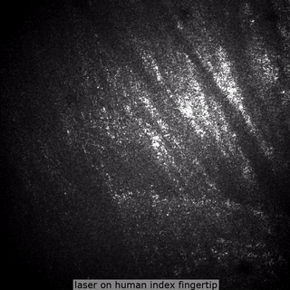

<p align="center">

</p>

<p align="center">
<b>Image laser speckle fluctuation to measure blood velocity</b>
</p>

<p align="center">
<a href="https://github.com/mattrohr/blood-velocity/actions?query=workflow%3Abuild">

</a>
</p>

## About


Typical lasers release one color of light at the same time. After it hits a surface, it reflects. If it's a perfect mirror, it will completely reflect. But if it hits a rough surface, waves will scatter in random directions. The rougher the surface, the more this scattering. When two lightwaves of the same color cross paths, they interfere. If they constructively interfere, there's a bright spot. If they destructively interfere, there's a dark spot. There's also partial interference, which results in a brightness between the two. We call these spots of varying brightness speckle. If the light hits a changing surface, like a drying wall of paint, the speckle pattern will change over time. The faster the evaporation, the faster this speckle change.

**This repository includes hardware and software to calculate surface brain blood flow.** If we also stimulate the brain, we can now determine how blood flow responds to neural activity. In patients with neural decline, blood response to stimulation may be delayed. We could then measure this delay to test for neurodegenerative diseases, like Alzheimers. Alzheimers is the only leading cause of death that can't be slowed, stopped, or cured.

If this is helpful in your work, please cite:

    @misc{rohr2021bloodvelocity,
      author = {Matthew Rohr},
      title = {Blood Velocity},
      year = {2021},
      howpublished = {\url{https://github.com/mattrohr/blood-velocity}},
      note = {commit xxxxxxx}
    }

## Installation
1. (_recommended_) Create and enter a Python virtual environment to minimize package conflict:
```bash
python3 -m venv venv && source venv/bin/activate
```

2. Install Python dependencies:
```bash
pip install -r src/requirements.txt
```

3. Run the demo:
```bash
python src/get-velocity.py
```

## Notes
wouldn't speckle change as a result of water evaporation on surface of brain

- Design decisions
    - Why Python? No license, unlike MATLAB
    - Why TIFF / TIF images?
- Why expensive laser?
    - if produced light is not consistently coherent, the interference pattern will change in time even if the surface and observer are not moving (image of hand-held laser). Thermal stability. good optics so uninform spread. Power regulation.
- Why expensive camera?
    - quantum efficiency.
- Tips
    - laser light -> heats surface = don't shine directly onto camera sensor

## Acknowledgements
- xxx for data collection
- xxx for LSCI algorithm.